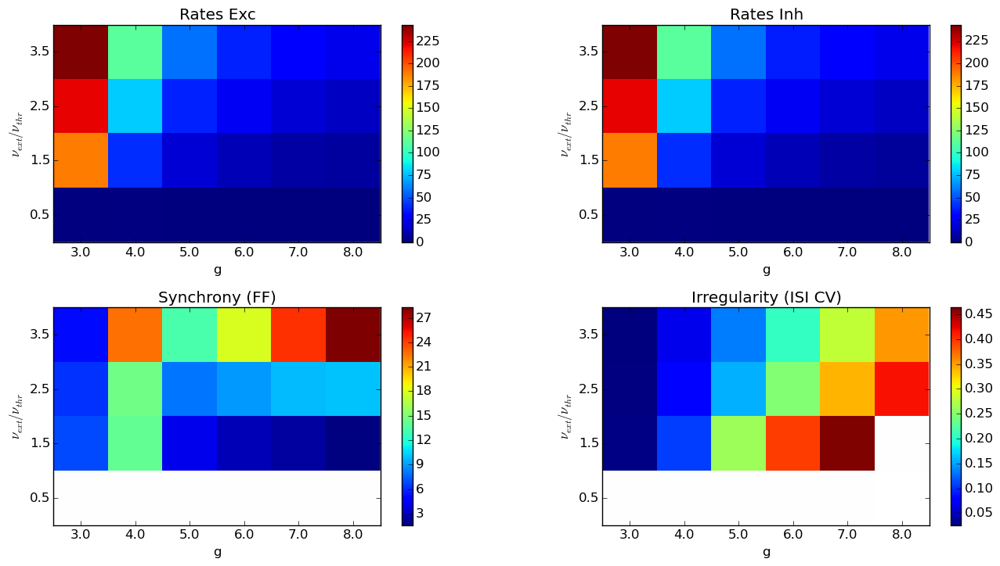
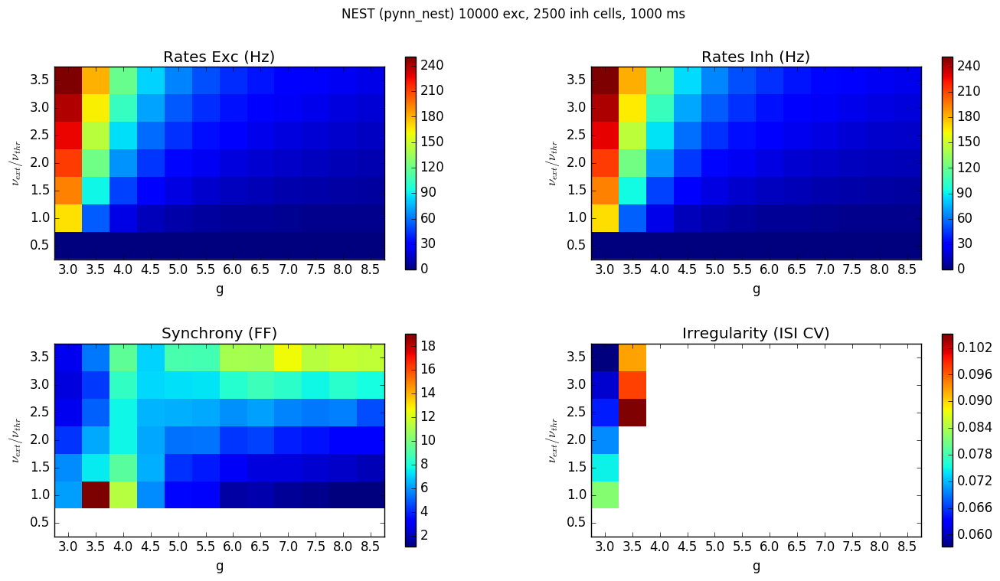
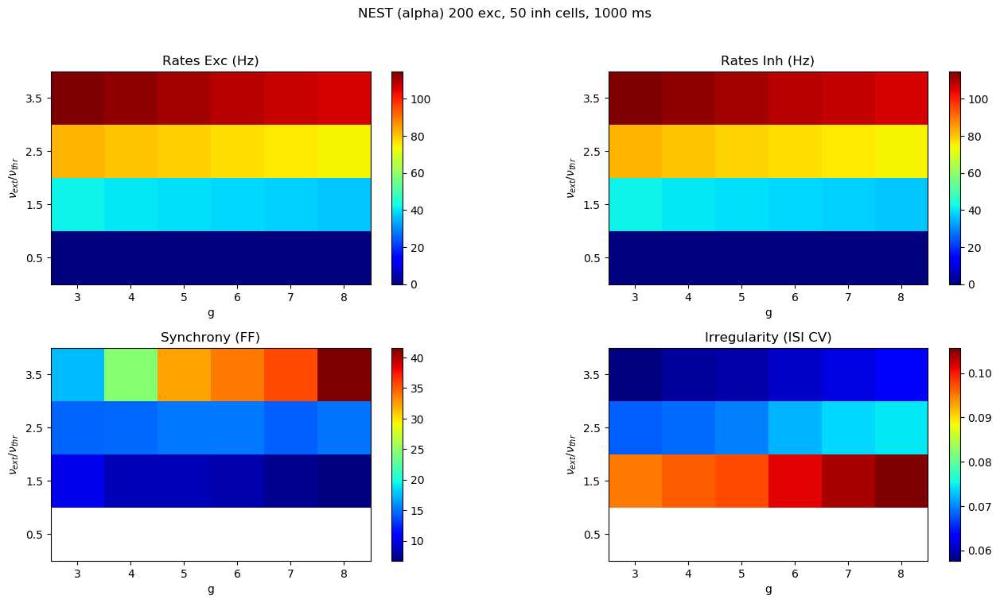
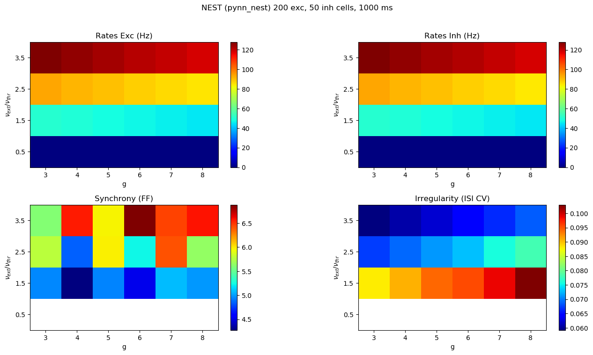
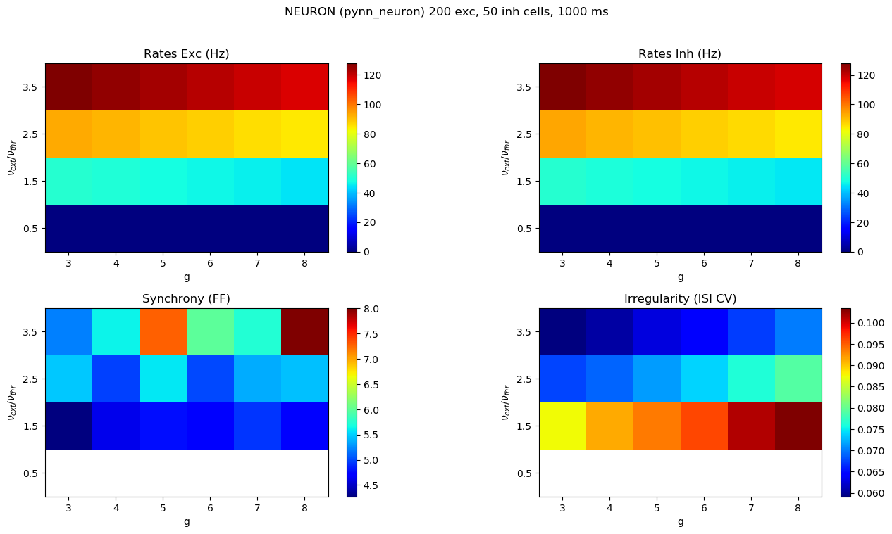
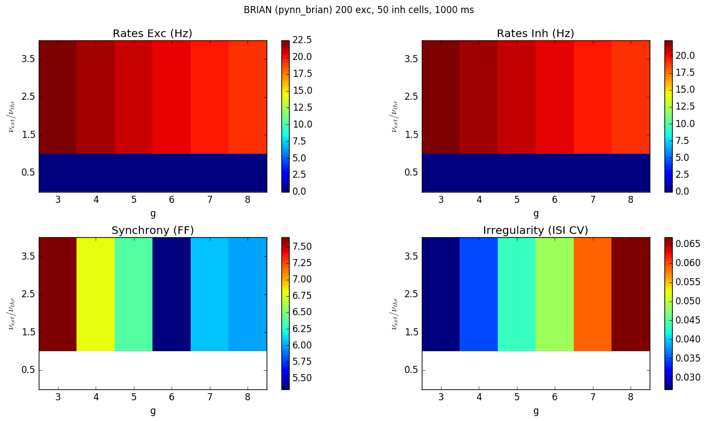
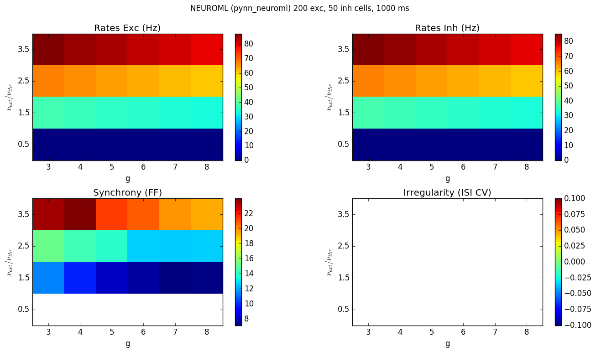

### Comparing Brunel model across implementations

_Note: work in progress!_

#### 12500 cell network

**NEST (delta synapses)**

**NEST (alpha synapses)**

**PyNN -> NEST**

#### 250 cell network

**NEST (alpha synapses)**

**PyNN -> NEST**
  

**PyNN -> NEURON**

**PyNN -> Brian**
 

**PyNN -> NeuroML2/LEMS -> jNeuroML_NEURON**
  
